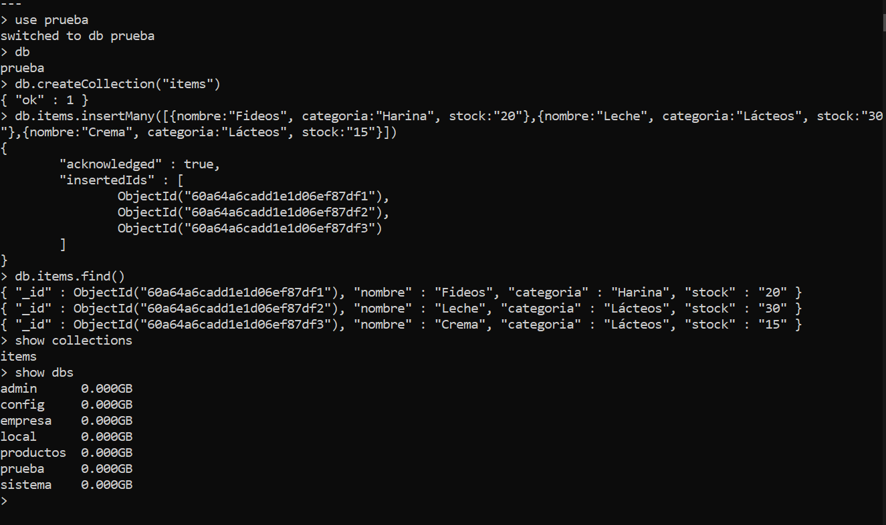

# Consigna:

En base al enunciado para trabajar con un motor SQL, realizar las adaptaciones para trabajar sobre un servidor de base de datos MongoDB. Utilizar el cliente CLI Mongo shell.

<ul>
    <li>Crear una base de datos llamada 'prueba'</li>
    <li>Crear una tabla dentro de esa base con el nombre 'items' que contenga los siguientes campos:
        <ul>
        <li>'nombre' del tipo varchar no nulo</li>
        <li>'categoria' del tipo varchar no nulo</li>
        <li>'stock' del tipo entero sin signo</li>
        <li>'id' clave primaria autoincremental no nula</li>
        </ul>
    </li>
    <li>Insertar estos 3 registros en esa tabla
        <ul>
        <li>Fideos, categoría:Harina, stock:20</li>
        <li>Leche, categoría:Lácteos, stock:30</li>
        <li>Crema, categoría:Lácteos, stock:15</li>
        </ul>
    </li>
    <li>Listar los registros agregados</li>
    <li>Mostrar al finalizar las bases de datos presentes en el motor de base de datos, las colecciones de la base 'prueba' y los documentos dentro de ella.</li>
</ul>

A continuación se muestran las sentencias en mongoDB realizadas en consola y escritas en el archivo .txt anexo.

